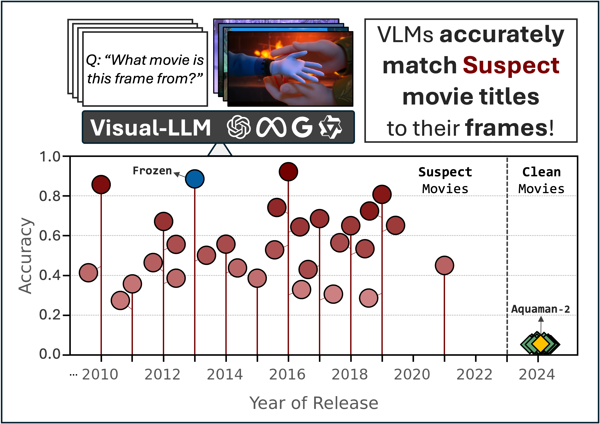
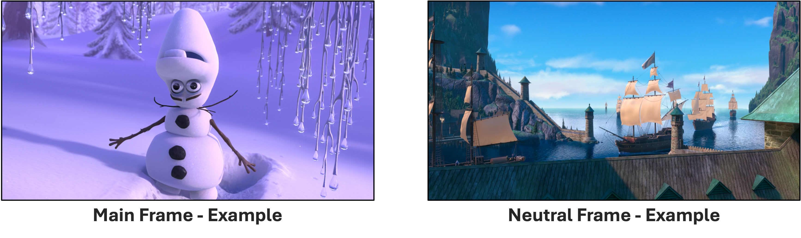

# DIS-CO 🪩

This is the official repository for the paper DIS-CO: Discovering Copyrighted Content in VLMs Training Data by André V. Duarte, Xuandong Zhao, Arlindo L. Oliveira and Lei Li<br>

DIS-CO is a method designed to infer whether copyrighted content was included in the training data of vision-language models (VLMs). By querying models with frames from targeted copyrighted media and analyzing their free-form responses, DIS-CO can provide strong evidence of memorization while remaining applicable to both white-box and black-box models.

<p align="center">
  
</p>


---

## 🚀 Instalation
To set up **DIS-CO**, follow these steps:

```bash
# Clone the repository
git clone https://github.com/avduarte333/DIS-CO
cd DIS-CO

# Create a conda environment
conda create -n disco_env python=3.10 pip -y
conda activate disco_env
```
---

## 🔹 Installing Dependencies

Choose one of the following options:

- **For a specific model (e.g., Gemini):**
  ```bash
  pip install -e .[gemini]
  ```
- **To install dependencies for all supported models:**
  ```bash
  pip install -e .[all]
  ```

---


## 🎬 Running DIS-CO

To run the **movie guessing task**, fill the attributes of `run_movie_guess.py` according to your needs:

```python
from movie_guess_utils import MovieGuessTask

task = MovieGuessTask(
    model_name="gpt-4o-2024-08-06",
    movie_option="full",
    frame_type="main",
    input_mode="single_image",
    clean_llm_output=False,
    results_base_folder="./Results",
    api_key="YOUR_API_KEY",
    hf_auth_token="HF_ACCESS_TOKEN",
    dataset = "DIS-CO/MovieTection"
)

# Execute the movie guessing task.
task.run()
```

Once set up, launch the task with:

```bash
python Code/run_movie_guess.py
```


---

## 🗄️ [MovieTection](https://huggingface.co/datasets/DIS-CO/MovieTection)
The MovieTection dataset is designed for image/caption-based question-answering, where models predict the movie title given a frame or its corresponding textual description.

### Dataset Structure 🚧
The dataset consists of **14,000 frames** extracted from **100 movies**, categorized into:
- **Suspect movies:** Released *before* September 2023, **potentially** included **in training data**.
- **Clean movies:** Released *after* September 2023, **outside** the models' **training data**.

Each movie contains **140 frames**, classified into:
- **Main Frames**: Featuring key characters from the plot.
- **Neutral Frames**: Backgrounds, objects, or minor characters.


<p align="center">
  
</p>


The dataset is organized into the following columns:

- `Movie` - The title of the movie from which the frame was extracted.

- `Frame_Type` - Categorization of the frame as either *Main* or *Neutral*.

- `Scene_Number` - Identifier for the scene within the movie. Scenes group related frames together based on their narrative context.

- `Shot_Number` - The identifier for the specific shot within a scene.

- `Image_File` - The image file of the frame.

- `Caption` - Detailed textual description of the frame, generated using Qwen2-VL 7B.

- `Label` - Binary value indicating whether the movie is categorized as clean (0) or suspect (1).

- `Answer` - List of acceptable movie title variations that should be considered correct when evaluating the model’s free-form responses.


---
## 📁 [MovieTection_Mini](https://huggingface.co/datasets/DIS-CO/MovieTection_Mini) - Dataset Alternative
This dataset is a compact subset of the full MovieTection dataset, containing only 4 movies instead of 100. It is designed for users who want to experiment with the benchmark without the need to download the entire dataset, making it a more lightweight alternative for testing.


---
## 💬 Citation

If you find this work useful, please consider citing our paper:

```bibtex
@misc{duarte_disco,
      title={DIS-CO: Discovering Copyrighted Content in VLMs Training Data}, 
      author={André V. Duarte and Xuandong Zhao, Arlindo L. Oliveira and Lei Li},
      year={2025},
      eprint={xxxx.yyyyy},
      archivePrefix={arXiv},
      primaryClass={cs.CL},
      url={https://arxiv.org/abs/xxxx.yyyyy}, 
}
```
