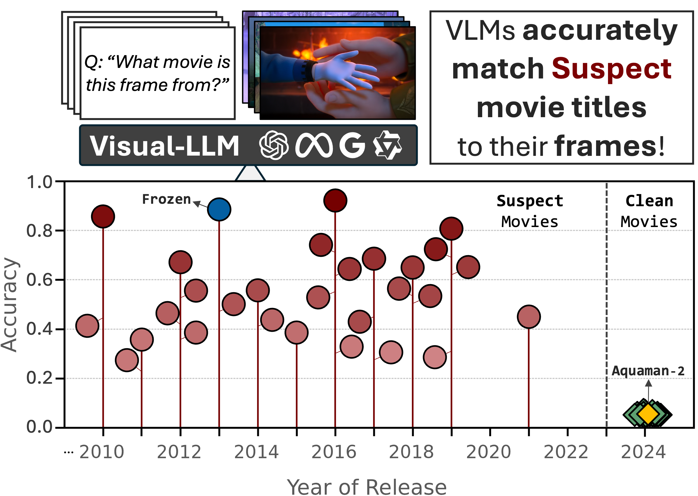

# DIS-CO 🪩

This is the official repository for the paper DIS-CO: Discovering Copyrighted Content in VLMs Training Data by André V. Duarte, Xuandong Zhao, Arlindo L. Oliveira and Lei Li<br>

DIS-CO is a method ...




---

## 🚀 Instalation
To set up **DIS-CO**, follow these steps:

```bash
# Clone the repository
git clone https://github.com/avduarte333/DIS-CO
cd DIS-CO

# Create a conda environment
conda create -n disco_env python=3.10 pip -y
conda activate disco_env
```
---

## 🔹 Installing Dependencies

Choose one of the following options:

- **For a specific model (e.g., GPT-4o):**
  ```bash
  pip install -e .[gpt]
  ```
- **To install dependencies for all supported models:**
  ```bash
  pip install -e .[all]
  ```

---


## 🎬 Running DIS-CO

To run the **movie guessing task**, fill the attributes of `run_movie_guess.py` accordingly:

```python
from movie_guess_utils import MovieGuessTask

task = MovieGuessTask(
    model_name="gpt-4o-2024-08-06",
    movie_option="full",
    frame_type="main",
    input_mode="single_image",
    clean_llm_output=False,
    results_base_folder="./results",
    api_key="YOUR_API_KEY",
    hf_auth_token="HF_ACCESS_TOKEN",
)

# Execute the movie guessing task.
task.run()
```

Once set up, launch the task with:

```bash
python Code/run_movie_guess.py
```


---

## 📚 [MovieTection](https://huggingface.co/datasets/DIS-CO/MovieTection)
The MovieTection dataset is designed for image/caption-based question-answering, where models predict the movie title given a frame or its corresponding textual description.

### Dataset Structure 🚧
The dataset consists of **14,000 frames** extracted from **100 movies**, categorized into:
- **Suspect movies:** Released **before September 2023**, potentially included in model training. `Label` column = 1.
- **Clean movies:** Released **after September 2023**, outside the models' training data cutoff. `Label` column = 0.

Each movie contains **140 frames**, classified into:
- **Main Frames**: (i) Featuring key characters from the plot; (ii) Easily recognizable to viewers who saw the movie.
- **Neutral Frames**: (i) Backgrounds, objects, or minor characters; (ii) Frames not easily tied to the movie's narrative.

| Main | Neutral |
|---------|---------|
|  |  |


Each frame is also paired with a **detailed caption**, generated using the Qwen2-VL 7B model.

The dataset is organized into the following columns:
- `Movie`: \<...\>
- `Frame_Type`: \<...\>
- `Scene_Number`: \<...\>
- `Shot_Number`: \<...\>
- `Image_File`: \<...\>
- `Caption`: \<...\>
- `Label`: \<...\>
- `Answer`: \<...\>


---
### 📖 MovieTection Alternative (Used for Baseline Methods)
We also release the same corpus on a subset format containing 4 Movies only.


---
### 🤝 Compatibility
DIS-CO is compatible with any VLM with strong reasoning capabilities.<br>
- In our code, we provide an implementation for Gemini and ChatGPT, but in fact, models like LLaMA-3, Mixtral 8x7B, or Command+R can also be used.<br>


---
## 💬 Citation

If you find this work useful, please consider citing our paper:

```bibtex
@misc{duarte_disco,
      title={DIS-CO: Discovering Copyrighted Content in VLMs Training Data}, 
      author={André V. Duarte and Xuandong Zhao, Arlindo L. Oliveira and Lei Li},
      year={2025},
      eprint={xxxx.yyyyy},
      archivePrefix={arXiv},
      primaryClass={cs.CL},
      url={https://arxiv.org/abs/xxxx.yyyyy}, 
}
```
